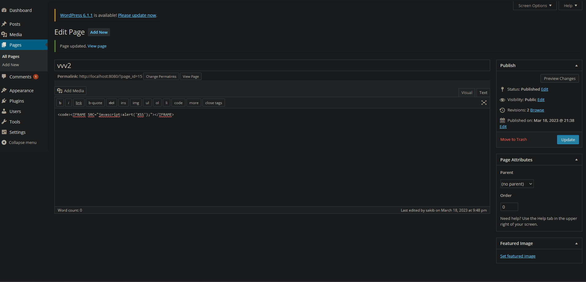
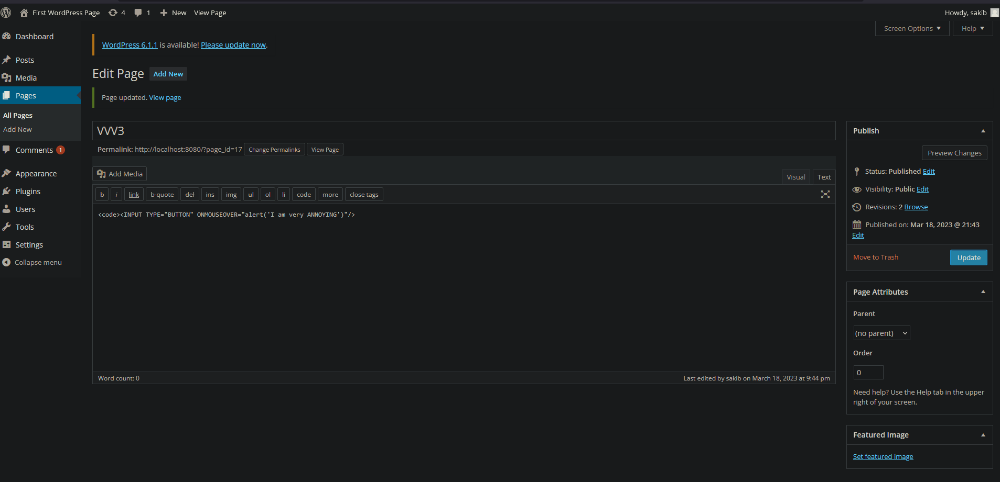

# Week-7-WordPress-vs-Kali
# Project 7 - WordPress Pen Testing

Time spent: **2** hours spent in total

> Objective: Find, analyze, recreate, and document **three vulnerabilities** affecting an old version of WordPress

## Pen Testing Report

### 1. User Enumeration

- [ ] Summary: 
  - Vulnerability types: User Enumeration
  - Tested in version: 4.2
  - Fixed in version: 4.3
- [ ] GIF Walkthrough: 
  
- [ ] Steps to recreate: If you enter an existing username, the system will indicate that the password is incorrect, thereby confirming the presence of the user.
  
### 2. Posting iFrame

- [ ] Summary: 
  - Vulnerability types: XSS
  - Tested in version: 4.2
  - Fixed in version: 4.3.2
- [ ] GIF Walkthrough: 
  
- [ ] Steps to recreate: When a post contains an iFrame, any scripts embedded within it may be activated upon page load.

### 3. Authenticated Stored Cross-Site Scripting (XSS)

- [ ] Summary: 
  - Vulnerability types: XSS 
  - Tested in version: 4.2
  - Fixed in version: 4.2.3
- [ ] GIF Walkthrough: 
  
- [ ] Steps to recreate: To showcase the vulnerability, utilize the following code by entering it into a page or post using HTML edit mode instead of the default WYSIWYG.

## Resources

- [WordPress Source Browser](https://core.trac.wordpress.org/browser/)
- [WordPress Developer Reference](https://developer.wordpress.org/reference/)

GIFs created with  ...
<!-- Recommended GIF Tools:
[Kap](https://getkap.co/) for macOS
[ScreenToGif](https://www.screentogif.com/) for Windows
[peek](https://github.com/phw/peek) for Linux. -->

## Notes

Describe any challenges encountered while doing the work

## License

    Copyright [yyyy] [name of copyright owner]

    Licensed under the Apache License, Version 2.0 (the "License");
    you may not use this file except in compliance with the License.
    You may obtain a copy of the License at

        http://www.apache.org/licenses/LICENSE-2.0

    Unless required by applicable law or agreed to in writing, software
    distributed under the License is distributed on an "AS IS" BASIS,
    WITHOUT WARRANTIES OR CONDITIONS OF ANY KIND, either express or implied.
    See the License for the specific language governing permissions and
    limitations under the License.
